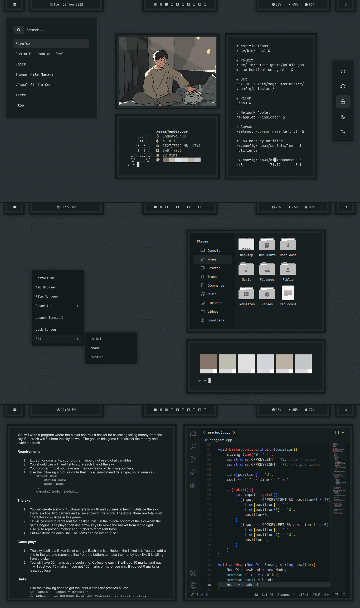

<h2 align="center"> BSPWM </h2>

<h2 align="center"> ━━━━━━  ❖  ━━━━━━ </h2>

## :herb: <samp>INFORMATION</samp>

- **Operating System:** [EndeavourOS](https://endeavouros.com/)
- **Window Manager:** [bspwm](https://github.com/baskerville/bspwm)
- **Terminal:** [alacritty](https://github.com/alacritty/alacritty)
- **File Manager:** [Thunar](https://docs.xfce.org/xfce/thunar/start)
- **Shell:** [zsh](https://www.zsh.org/)
- **Panel:** [polybar](https://github.com/polybar/polybar)
- **Compositor:** [picom-ibhagwan-git](https://github.com/ibhagwan/picom-ibhagwan-git)
- **Notification Manager:** [dunst](https://github.com/dunst-project/dunst)
- **GTK Theme:** [Everblush GTK](https://github.com/Everblush/gtk)
- **VScode Theme:** [Everblush](https://github.com/Everblush/vscode)
- **Icon Theme:** [Tela Grey](https://www.xfce-look.org/p/1279924/)
- **Application Launcher:** [rofi](https://github.com/davatorium/rofi)
- **Application Menu:** [jgmenu](https://github.com/johanmalm/jgmenu)

<h2></h2>

## ⭐ Credits
- jgmenu was created by [TheRealKizu](https://www.reddit.com/r/unixporn/comments/vlqhzb/bspwm_comfy_rocky_beach/)
- Wallpaper was created using [heropatterns](https://heropatterns.com/)
- Rofi configs was taken from [archcraft os](https://archcraft.io/flavors.html)
- Polybar modules was taken from [adi1090x](https://github.com/adi1090x/polybar-themes)
- Photo of a man with his dog was created by [0_00jakup](https://www.instagram.com/0_00jakup/?hl=en)

